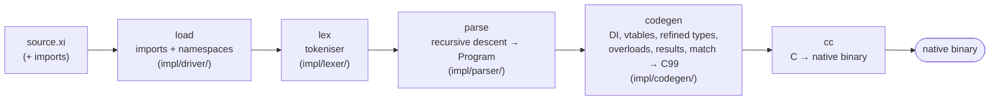

# Compiler internals (for contributors)

> You don't need this page to **write** Xi — it's about how the toolchain itself
> is built. See [Getting started](getting-started.md) and the
> [Language guide](language-guide.md) to use the language. This page is for people
> hacking on the compiler.

## The compiler is written in Xi

`compiler/xc.xi` is the Xi compiler, written in Xi. It is a manifest that imports
two layers: an **abstraction layer** (`contracts/` — every interface) and an
**implementation layer** (`impl/` — all the code). The stages and services are
wired together with Xi's own dependency injection: classes declare `deps` on the
*interfaces*, and the `module` in `impl/driver/app.xi` binds the implementations.
Each interface and class lives in its own file.

| Layer / folder | Role |
|----------------|------|
| `contracts/` | the contracts: `Lexer`, `Parser`, `Codegen`, `Compiler`, plus the FFI components `Text`, `TokenArrays`, `SpecArrays`, `Host` (file IO, env, processes) and `Diagnostics` |
| `impl/ffi/text/`, `impl/ffi/arrays/`, `impl/ffi/host/`, `impl/ffi/diag/` | the FFI components — each file declares its `extern "C"` block on top (externs cannot live in a class) and a class (`StdText`, `StdTokenArrays`, `StdSpecArrays`, `PosixHost`, `Diag`) that wraps it |
| `impl/lexer/`   | source text → tokens (`scanner.xi` logic + `XiLexer`) |
| `impl/parser/`  | tokens → `Program` (`grammar.xi` logic + `XiParser`) |
| `impl/codegen/` | `Program` → C99 (`core/xtype/expr/seq/postfix/stmt/decl/emit/top.xi` passes + `XiCodegen`) |
| `impl/driver/`  | `import` resolution + the DI-wired `XcCompiler` + composition root (`app.xi`) |

`XcCompiler` depends on the three stage interfaces **and** on `Host` +
`Diagnostics`, so the orchestration reads/writes files, runs the C compiler, and
reports errors through injected services rather than raw FFI. Pure value helpers
(string ops, char classes, typed-array accessors) stay as free functions called
directly.

The toolchain is **four binaries**, each its own manifest + `module` (the module
holds the metadata fields and the `entry`):

| Manifest | Module | Binary | Role |
|----------|--------|--------|------|
| `compiler/xc.xi` | `Compile` | `xc` | the compiler |
| `compiler/xi.xi` | `Xi` | `xi` | REPL / run tool (parts under `compiler/repl/`) |
| `compiler/test.xi` | `Test` | `xt` | test runner (parts under `compiler/testing/`) |
| `compiler/loadtest.xi` | `LoadTest` | `loadtest` | load/perf tester |

`xc` links the private FFI in `compiler/xc_helpers.c` (via `XC_HELPERS`), so it is
built only by `bootstrap.sh` — `xc --all` skips any manifest sitting next to
`xc_helpers.c`. The other three link only the normal runtime + std.

The compiler emits C and then invokes `cc` to produce a native binary. The only
non-Xi code is:

- `runtime/runtime.{h,c}` — the runtime: primitive types, strings, arrays,
  optionals, regex for refined-type `matches`, file/stdin I/O, and the
  `cc`-invocation helper. This is Xi's equivalent of libc/libcore.
- `compiler/xc_helpers.c` — C primitives the compiler declares via `extern "C"`
  (growable typed arrays, file I/O, `cc` invocation). It is appended into the
  generated C, sharing the translation unit.

## Bootstrapping from source

Self-hosting has a chicken-and-egg problem: you need a compiler to build the
compiler. Xi solves it by **seeding from a released binary** — the previously
published `xc` for your platform:

```
released xc   (downloaded by compiler/fetch-seed.sh)
        │  xc compiler/xc.xi          (Xi compiling Xi)
        ▼
       xc   (built from current source)
        │  xc compiler/xc.xi          (self-rebuild)
        ▼
       xc   (shipped compiler — from source, not the download)
```

`./compiler/bootstrap.sh` runs exactly this. There is no checked-in C seed, so
building requires a prior release for your OS/arch (or `XC_SEED=/path/to/xc` to
build offline).

## The fixpoint test

A correct self-hosting compiler is a **fixpoint**: compiling its own source with
generation *N* yields the same C as generation *N+1*.

```
gen0 = the released seed compiler
gen1 = xc.xi compiled by gen0          (current source, seed codegen)
gen2 = xc.xi compiled by gen1          (current source, current codegen)
gen3 = xc.xi compiled by gen2
assert  C(gen2 on xc.xi) == C(gen3 on xc.xi)     # byte-identical
```

Comparing gen2 and gen3 (both built from current source) makes the test correct
even when the seed release predates the working tree. `./compiler/selfhost.sh`
performs this build and diffs the outputs.

## Compilation pipeline



## What runs at runtime

DI resolution, overload dispatch tables, and refined-type layout are decided at
compile time. At runtime you pay for: one branch per `when`/overload guard, one
vtable indirection per (non-devirtualized) interface call, and the async
state-machine when used. There is no VM, no GC, and no reflection.

## Project layout

```
compiler/
  xc.xi          manifest for the compiler         (module Compile -> ./compiler/xc)
  xi.xi          manifest for the REPL / run tool   (module Xi      -> ./bin/xi)
  test.xi        manifest for the test runner       (module Test    -> ./bin/xt)
  loadtest.xi    manifest for the load tester       (module LoadTest-> ./bin/loadtest)
  contracts/     the abstraction layer: every interface
  impl/          the implementation layer: ffi/ (text/ arrays/ host/ diag/ — each an extern block + wrapper class) + lexer/ parser/ codegen/ driver/
  repl/          the REPL / run tool parts (runner/repl/xi_repl)
  testing/       the test runner parts (tester/test_runner)
  xc_helpers.c  C primitives (extern "C")
  fetch-seed.sh download the released seed compiler
  bootstrap.sh selfhost.sh
runtime/
  runtime.h runtime.c   the C runtime
examples/
  <subject>/     demos + *_test.xi grouped by subject (language, classes,
                 collections, di, concurrency, events, state, web,
                 serialization, stdlib, …)
  showcase/      full multi-file project (import + namespace)
docs/            this documentation (MkDocs)
```
