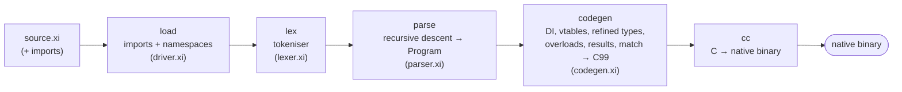

# Compiler internals (for contributors)

> You don't need this page to **write** Xi — it's about how the toolchain itself
> is built. See [Getting started](getting-started.md) and the
> [Language guide](language-guide.md) to use the language. This page is for people
> hacking on the compiler.

## The compiler is written in Xi

`compiler/xc.xi` is the Xi compiler, written in Xi. It is split across four files
(imported by the `xc.xi` manifest):

| File | Role |
|------|------|
| `lexer.xi`   | source text → tokens |
| `parser.xi`  | tokens → `Program` (spec structs) |
| `codegen.xi` | `Program` → C99 |
| `driver.xi`  | `import` resolution + entry point |

The compiler emits C and then invokes `cc` to produce a native binary. The only
non-Xi code is:

- `runtime/runtime.{h,c}` — the runtime: primitive types, strings, arrays,
  optionals, regex for refined-type `matches`, file/stdin I/O, and the
  `cc`-invocation helper. This is Xi's equivalent of libc/libcore.
- `compiler/xc_helpers.c` — C primitives the compiler declares via `extern "C"`
  (growable typed arrays, file I/O, `cc` invocation). It is appended into the
  generated C, sharing the translation unit.

## Bootstrapping from source

Self-hosting has a chicken-and-egg problem: you need a compiler to build the
compiler. Xi solves it by **seeding from a released binary** — the previously
published `xc` for your platform:

```
released xc   (downloaded by compiler/fetch-seed.sh)
        │  xc compiler/xc.xi          (Xi compiling Xi)
        ▼
       xc   (built from current source)
        │  xc compiler/xc.xi          (self-rebuild)
        ▼
       xc   (shipped compiler — from source, not the download)
```

`./compiler/bootstrap.sh` runs exactly this. There is no checked-in C seed, so
building requires a prior release for your OS/arch (or `XC_SEED=/path/to/xc` to
build offline).

## The fixpoint test

A correct self-hosting compiler is a **fixpoint**: compiling its own source with
generation *N* yields the same C as generation *N+1*.

```
gen0 = the released seed compiler
gen1 = xc.xi compiled by gen0          (current source, seed codegen)
gen2 = xc.xi compiled by gen1          (current source, current codegen)
gen3 = xc.xi compiled by gen2
assert  C(gen2 on xc.xi) == C(gen3 on xc.xi)     # byte-identical
```

Comparing gen2 and gen3 (both built from current source) makes the test correct
even when the seed release predates the working tree. `./compiler/selfhost.sh`
performs this build and diffs the outputs.

## Compilation pipeline



## What runs at runtime

DI resolution, overload dispatch tables, and refined-type layout are decided at
compile time. At runtime you pay for: one branch per `when`/overload guard, one
vtable indirection per (non-devirtualized) interface call, and the async
state-machine when used. There is no VM, no GC, and no reflection.

## Project layout

```
compiler/
  xc.xi          manifest (imports the parts)
  lexer.xi parser.xi codegen.xi driver.xi   the compiler, in Xi
  repl.xi        the REPL / run tool (compiled to ./bin/xi)
  xc_helpers.c  C primitives (extern "C")
  fetch-seed.sh download the released seed compiler
  bootstrap.sh selfhost.sh
runtime/
  runtime.h runtime.c   the C runtime
examples/
  *.xi            single-file examples
  proj/          multi-file example (import + namespace)
docs/            this documentation (MkDocs)
```
