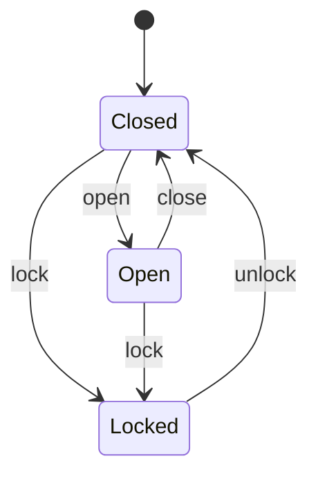

# Machines (finite state machines)

A **`machine`** is a finite state machine expressed as an **immutable value**. You
declare a set of named **`states`**, the **`initial`** state, any **`terminal`**
states, and a set of **named transitions** — each an edge `name : From… -> To`.
Calling a transition returns a *new* machine value in the target state; the old
value is untouched. An illegal move signals the built-in **`IllegalTransition`**
interrupt, so the caller decides whether to `recover` (stay put) or unwind.

```x
machine Door {
    states  Closed, Open, Locked
    initial Closed
    terminal -                       // none; use `terminal Done, Cancelled` otherwise
    open   : Closed       -> Open
    close  : Open         -> Closed
    lock   : Closed, Open -> Locked   // an edge may start from several states
    unlock : Locked       -> Closed
}
```



```x
let d = Door.start()        // construct in the initial state
d = d.open()                // -> Open
d = d.lock()                // -> Locked
system.stdout.writeln(d.state)      // "Locked"
system.stdout.writeln(d.isTerminal())  // false
```

## Semantics

- **`machine M { … }`** declares an immutable value type `M` carrying its current
  state.
- **`states A, B, C`** — the legal states. **`initial A`** — where `M.start()`
  begins. **`terminal …`** — states from which no transition is expected (`-`
  means none); `value.isTerminal()` reports whether the current state is one.
- A transition **`name : From… -> To`** is a method `value.name()` returning a new
  `M` in state `To`. The left side may list several source states.
- **`value.state`** is the current state's name as a `String`.
- Calling a transition from a state that isn't one of its sources signals
  **`IllegalTransition { from: String, to: String }`**. Wrap the call in
  `try { … } catch e: IllegalTransition { … recover }` to stay in the current
  state, or let it propagate. (See [interrupts](interrupts.md).)

```x
try {
    d = d.open()            // Locked has no `open` edge
} catch e: IllegalTransition {
    system.stdout.writeln("illegal " + e.from + " -> " + e.to)
    recover                 // resume: d keeps its current value
}
```

## Lowering

A machine compiles to a small integer tag plus pure functions — no runtime
machinery beyond a comparison and a struct copy:

```c
typedef struct { xc_integer_t __state; } xc_Door_t;
static xc_Door_t   xc_Door__start(void);          /* Door.start() */
static xc_string_t xc_Door__state(xc_Door_t);     /* d.state      */
static xc_boolean_t xc_Door__isTerminal(xc_Door_t);
static xc_Door_t   xc_Door__open(xc_Door_t self); /* checks source, else signals */
```

Each transition checks the current tag against its allowed sources; on a match it
returns a copy with the new tag, otherwise it raises `IllegalTransition`.

## Machines vs. atoms

A machine value is **immutable and explicit** — every move produces a new value
you thread yourself (`d = d.open()`), and the legal-transition graph is enforced.
An [atom](atoms.md) is a **single global holder** whose value you swap in place via
`name.dispatch(...)`. Use a machine when the *shape of the lifecycle* matters; use
an atom when you just need one evolving piece of state.

## Notes & limits

- The state is the only thing carried — per-state data payloads and transition
  guards are [proposed](proposals/state-machines.md), not yet implemented.
- Transitions are synchronous and single-threaded.

See `examples/machine_demo.x`.
