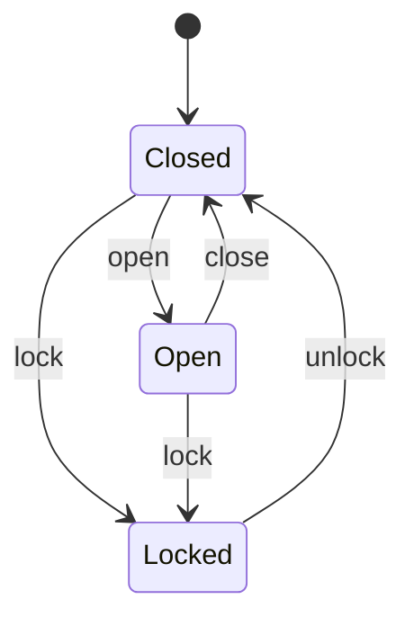

# Machines (finite state machines)

A **`machine`** is a finite state machine expressed as an **immutable value**. You
declare a set of named **`states`**, the **`initial`** state, any **`terminal`**
states, and a set of **named transitions** - each an edge `name : From… -> To`.
Calling a transition returns a *new* machine value in the target state; the old
value is untouched. An illegal move signals the built-in **`IllegalTransition`**
interrupt, so the caller decides whether to `recover` (stay put) or unwind.

```x
machine Door {
    states  Closed, Open, Locked
    initial Closed
    terminal -                       // none; use `terminal Done, Cancelled` otherwise
    open   : Closed       -> Open
    close  : Open         -> Closed
    lock   : Closed, Open -> Locked   // an edge may start from several states
    unlock : Locked       -> Closed
}
```



```x
let d = Door.start()        // construct in the initial state
d = d.open()                // -> Open
d = d.lock()                // -> Locked
system.stdout.writeln(d.state)      // "Locked"
system.stdout.writeln(d.isTerminal())  // false
```

## Semantics

- **`machine M { … }`** declares an immutable value type `M` carrying its current
  state.
- **`states A, B, C`** - the legal states. **`initial A`** - where `M.start()`
  begins. **`terminal …`** - states from which no transition is expected (`-`
  means none); `value.isTerminal()` reports whether the current state is one.
- A transition **`name : From… -> To`** is a method `value.name()` returning a new
  `M` in state `To`. The left side may list several source states.
- **`value.state`** is the current state's name as a `String`.
- Calling a transition from a state that isn't one of its sources signals
  **`IllegalTransition { from: String, to: String }`**. Wrap the call in
  `try { … } catch e: IllegalTransition { … recover }` to stay in the current
  state, or let it propagate. (See [interrupts](interrupts.md).)

```x
try {
    d = d.open()            // Locked has no `open` edge
} catch e: IllegalTransition {
    system.stdout.writeln("illegal " + e.from + " -> " + e.to)
    recover                 // resume: d keeps its current value
}
```

## Data, parameters, guards & updates

A machine may carry **machine-wide `data`** (extended state), and a transition may
take **parameters**, be gated by a **`where` guard**, and **`update`** the data:

```x
machine Lock {
    states  Locked, Open
    initial Locked
    data { code: String = "1234", attempts: Integer = 0 }   // context + initial values

    unlock(attempt: String) : Locked -> Open
        where attempt == data.code                          // guard gates the move
        update { attempts: 0 }                              // next context (partial)

    fail(attempt: String) : Locked -> Locked
        where attempt != data.code
        update { attempts: data.attempts + 1 }

    lock : Open -> Locked
}
```

- **`data { f: T = expr, … }`** declares the context; `Lock.start()` seeds it with
  the initial expressions. Read it with **`value.data.f`**.
- A transition **`name(params) : from… -> to`** may add:
  - **`where <guard>`** - a boolean over the params and `data`; the move is legal
    only if the source state matches **and** the guard holds. A failed guard is an
    illegal move (signals `IllegalTransition`), exactly like a wrong source state.
  - **`update { f: expr, … }`** - produces the next context; only the listed fields
    change (the rest carry over). `expr` may read `data` (the old context) and the
    params.
- **`value.can(name, args…)`** reports whether a transition would be legal (source
  state + guard) **without** performing it.

```x
let l = Lock.start()             // Locked, attempts=0
l = l.fail("0000")               // guard holds -> stays Locked, attempts=1
if l.can(unlock, "1234") { l = l.unlock("1234") }   // -> Open, attempts reset to 0
system.stdout.writeln(l.state + " / " + l.data.attempts)
```

Guards are written on the line following the arrow; `update` blocks may span lines.

## Machines vs. atoms

A machine value is **immutable and explicit** - every move produces a new value
you thread yourself (`d = d.open()`), and the legal-transition graph is enforced.
An [atom](atoms.md) is a **single global holder** whose value you swap in place via
`name.dispatch(...)`. Use a machine when the *shape of the lifecycle* matters; use
an atom when you just need one evolving piece of state.

## Static checks

The compiler validates each machine graph at compile time:

- **Unknown states** referenced by a transition's source or target (or by
  `initial`/`terminal`) are **errors**.
- **Unreachable states** (not reachable from `initial` by following transitions)
  and **dead ends** (a non-terminal state with no outgoing transition) are
  **warnings**.

```console
$ xc app.xi
xc: app.xi: warning: machine Door: state 'Ghost' is unreachable from 'Closed'
xc: app.xi: warning: machine Door: non-terminal state 'Ghost' has no outgoing transition (dead end)
```

## Notes & limits

- `data` is **machine-wide context** shared by all states; fields may be any type,
  including arrays (`Integer[]`, …). **Per-state** data (distinct fields per
  state) can be modelled by making a `data` field a [sum type](language-guide.md#sum-algebraic-types).
- Transitions are synchronous and single-threaded; entry/exit actions and `async`
  transitions aren't supported yet.

See `examples/state/machine_demo.xi` (data-less) and `examples/state/machine_data_demo.xi`
(data + guards + `update` + `can`).
